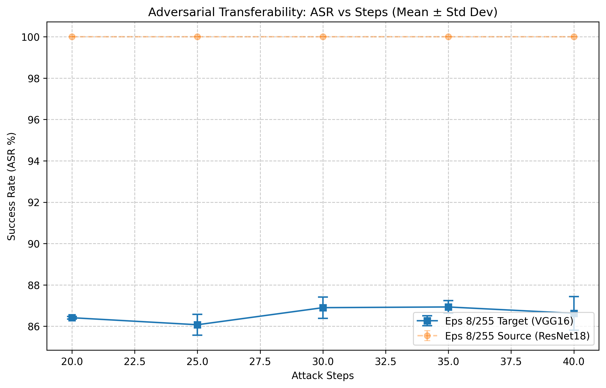

# 实验报告 01：黑盒迁移攻击基准与步数饱和性消融研究

**实验日期**：2026-03-19
**实验负责人**：陈玉铭
**项目名称**：基于模型迁移性的对抗样本实战

---

## 1. 实验目的 (Motivation)
在开展对抗防御研究之前，必须首先建立一个稳定且强力的“攻击基准”。本实验旨在：
1. 量化 ResNet18 生成的对抗样本在黑盒目标模型 VGG16 上的迁移成功率 (ASR)。
2. 探究迭代步数 (Steps) 与迁移效能之间的非线性关系，寻找 ASR 的边际效应递减点（饱和点）。
3. 确立后续防御评估实验的统一攻击参数，排除因攻击强度不足导致的“虚假防御”现象。

## 2. 实验配置 (Experimental Setup)
* **数据集**: ImageNet-1K 验证集 (采样 5000 张)
* **攻击算法**: PGD (Projected Gradient Descent)
* **扰动约束**: epsilon = 8/255, **alpha = 2/255**
* **模型架构**: 
    * 源模型 (代理): ResNet18 (Pretrained)
    * 目标模型 (受害者): VGG16 (Pretrained)
* **统计可靠性**: 每一组参数均运行 3 次独立重复实验 (Trials=3)，记录均值与标准差。

---

## 3. 实验过程与结果分析 (Results & Analysis)

### 3.1 第一阶段：全局参数敏感性分析 (Global Sensitivity Analysis)
**目的**：初步探索扰动预算 epsilon 和迭代步数 Steps 对迁移成功率 (ASR) 的交叉影响。

*图 1：展示了 epsilon 与 Steps 的协同效应，选定 epsilon=8/255 作为平衡点。*

**实验发现**：
* **epsilon 效应**：ASR 随 epsilon 的增大呈显著线性上升趋势。epsilon = 4/255 时攻击力不足，而 epsilon = 16/255 虽然 ASR 较高，但扰动已显著影响原图视觉质量。
* **Steps 效应**：初步观察到在 10 步之后，ASR 的提升斜率开始放缓。
* **决策**：选定 **epsilon = 8/255** 作为后续核心约束。

---

### 3.2 第二阶段：宽幅攻击极限探测 (Wide-range Limit Detection)
**目的**：在固定 epsilon 下，探索 ASR 是否会随步数增加而无限增长，寻找物理极限。

*图 2：展现了从 5 步到 100 步的长期演化趋势。*

**实验发现**：
* **平台期确立**：实验证实 ASR 存在明显的“天花板”。当步数超过 40 步后，曲线进入明显的平台期。
* **过拟合风险**：在 60 步至 100 步区间，ASR 甚至出现了轻微的震荡下降。这可能是由于对抗样本过度拟合了代理模型 (ResNet18) 的特定决策边界，反而降低了在目标模型 (VGG16) 上的泛化迁移能力。
* **决策**：确定最优攻击参数位于 20-40 步的精细区间内。

---

### 3.3 第三阶段：饱和拐点精细化消融 (Fine-grained Ablation Study)
**目的**：通过等间距的小步长采样，锁定计算开销与攻击效能的最优平衡点。

*图 3：针对 20-40 步区间的精细化观测，确立最终饱和点。*

**实验发现**：
* **拐点锁定**：ASR 在 30 步左右达到约 **86.9%** 的峰值。
* **显著性分析**：观察误差棒 (Error Bars) 可以发现，35 步与 40 步的结果与 30 步高度重叠。这证明继续增加步数带来的性能提升在统计学上是不显著的，且增加了不必要的计算开销。

---

## 4. 结论与核心洞察 (Conclusion & Insights)

### 4.1 攻击基准的确立
本实验成功锁定了本项目的第一阶段攻击标准：**$\epsilon = 8/255, Steps = 30, \alpha = 2/255$**。在此配置下，黑盒迁移 ASR 稳定在约 **86.9% (±0.4%)**。

### 4.2 核心科研洞察
1. **迁移性的非线性饱和**：在 $\alpha=2/255$ 时，只需 4 步即可触及边界，30 步已足以完成局部空间的最优搜索。继续迭代不仅无法提升迁移率，反而会浪费计算资源。
2. **泛化性平衡**：过多的迭代可能导致对抗样本“死磕”源模型的决策边界，造成泛化性下降。实验证明，适度的迭代步数（如 30 步）更有利于跨模型的黑盒迁移。
3. **计算优化建议**：将步数从 100 步压缩至 30 步，在保持 ASR 损失忽略不计的前提下，节省了约 **70%** 的计算开销，这为后续大规模防御测试奠定了基础。

### 4.3 对后续研究的指导
后续的“实验 02：输入变换防御评估”将统一采用此饱和攻击参数。若某种防御手段（如 JPEG 压缩）能在此强力攻击下显著降低 ASR，则证明该防御具备真实的实战鲁棒性。

---