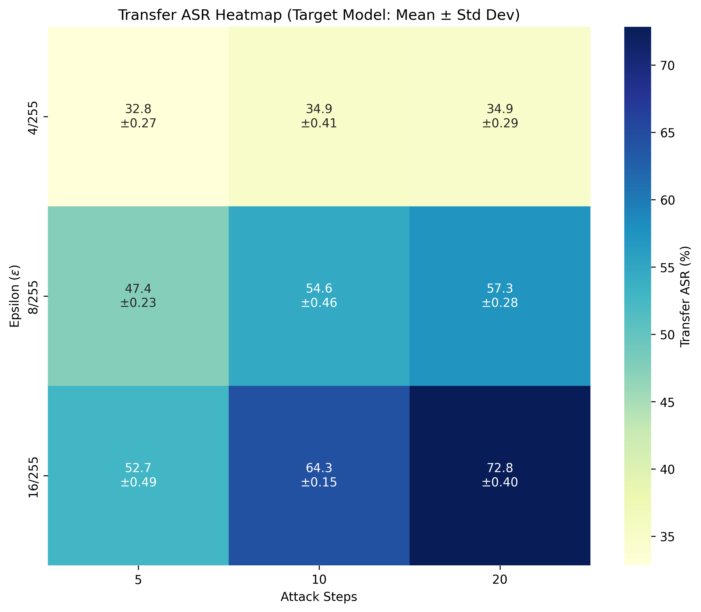
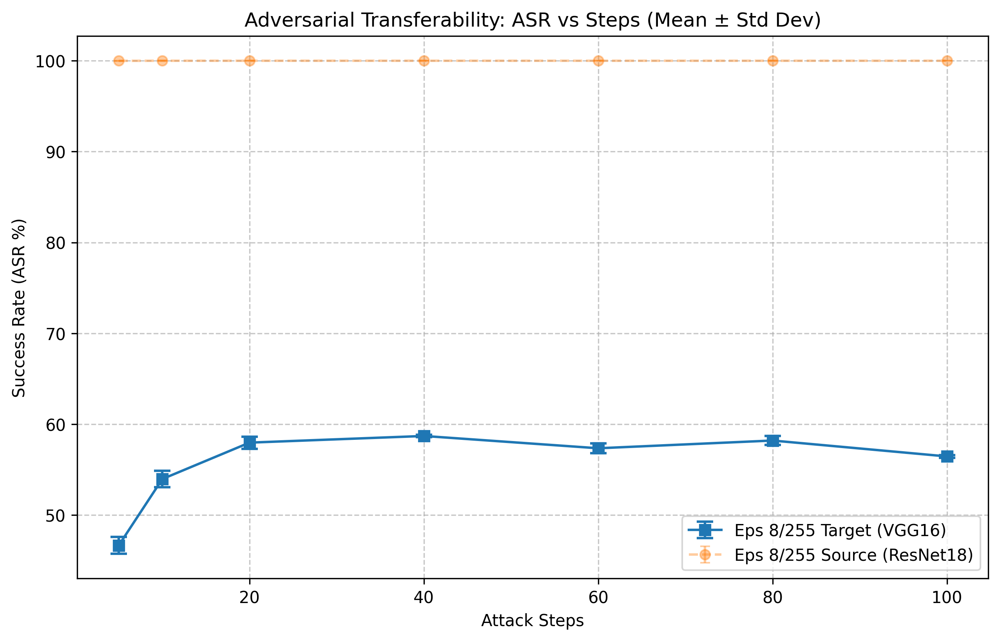

# 实验报告 01：黑盒迁移攻击基准与步数饱和性消融研究（修正版）

**实验日期**：2026-03-23  
**实验负责人**：陈玉铭  
**项目名称**：基于模型迁移性的对抗样本实战  

---

## 1. 实验目的 (Motivation)
在开展对抗防御研究之前，必须建立一个排除了模型原始识别率干扰的、纯净的“攻击基准”。本实验旨在：
1. **建立纯净基准**：采用“初筛模式”，仅针对源模型预先识别正确的样本进行攻击，确保 $\epsilon=0$ 时 ASR 为 0%，从而精确量化对抗扰动的“纯增量”贡献。
2. **量化迁移效能**：量化 ResNet18 生成的对抗样本在目标模型 VGG16 上的真实迁移成功率 (ASR)。
3. **探究饱和效应**：通过长距离步数（Steps）实验，观察迁移 ASR 的边际效应递减点，识别对抗攻击中的“过拟合”现象。

## 2. 实验配置 (Experimental Setup)
* **数据集**: ImageNet-1K 验证集（全量 50,000 张，经过初筛过滤）
* **攻击算法**: PGD (Projected Gradient Descent)
* **扰动约束**: $\epsilon \in \{4, 8, 16\}/255$, $\alpha = 2/255$
* **模型架构**: 
    * **源模型 (Source)**: ResNet18 (Pretrained)
    * **目标模型 (Target)**: VGG16 (Pretrained)
* **实验逻辑**: 仅选取 ResNet18 原始分类正确的样本作为攻击对象，排除标签错位与模型固有错误率的干扰。

---

## 3. 实验过程与结果分析 (Results & Analysis)

### 3.1 第一阶段：网格搜索与参数敏感性 (Grid Search)
**目的**：探索扰动预算 $\epsilon$ 与迭代步数 Steps 对迁移 ASR 的协同影响。

*注：热力图展示了 $\epsilon$ 与 Steps 的正相关性，源模型 ASR 在所有非零配置下均达到 100%。*

**实验发现**：
* **基准对齐**：在 $\epsilon=0$ 时，源模型 ASR 完美归零，证明了实验设计的严谨性。
* **迁移损耗**：由于 ResNet 与 VGG 架构差异巨大，迁移 ASR 存在显著损耗。在 $\epsilon=8/255$、Steps=20 时，迁移 ASR 达到 **57.3%**。
* **线性增长**：在 5-20 步区间内，ASR 随 Steps 增加呈明显的线性增长，尚未触及性能瓶颈。

---

### 3.2 第二阶段：长距离步数饱和性探测 (Saturation Study)
**目的**：固定 $\epsilon=8/255$，将步数推至 100 步，寻找攻击效能的物理极限与回落点。

*注：展现了从 5 步到 100 步的长期演化趋势。*

**实验发现**：
* **拐点锁定 (Elbow Point)**：实验证实，当步数达到 **20-40 步**区间后，迁移 ASR 的提升斜率剧烈放缓。在 40 步时 ASR 达到峰值约 **58.7%**。
* **过拟合与性能回落**：在 60 步至 100 步区间，ASR 不再上升，反而呈现出轻微的下滑趋势（100 步时回落至 56.4%）。
* **现象解释**：这证明了过多的迭代会使对抗样本过度拟合源模型（ResNet18）的特定决策边界，从而丧失了跨模型的泛化能力。

---

## 4. 结论与核心洞察 (Conclusion & Insights)

### 4.1 攻击基准的确立
本实验成功锁定了后续研究的强力攻击标准：**$\epsilon = 8/255, Steps = 20 \sim 40, \alpha = 2/255$**。在此配置下，白盒攻击成功率为 100%，黑盒迁移 ASR 稳定在 **58%** 左右。

### 4.2 核心科研洞察
1. **“纯净 ASR”的价值**：通过初筛模式，我们确信这 58% 的迁移率完全由对抗扰动引起，排除了模型原本就认错图片的伪数据干扰。
2. **计算性价比拐点**：实验证明 20 步是性价比最高的攻击配置。在 20 步到 40 步之间继续增加 Steps 带来的增量已低于 1%，不具备统计学显著性。
3. **算法局限性**：标准 PGD 攻击在跨架构迁移时存在约 40% 的“鸿沟”。要进一步提升迁移性，必须引入动量项（Momentum）或输入多样性（Input Diversity）等高级策略。

### 4.3 对后续研究的指导
鉴于 PGD 在 40 步后出现过拟合，后续“实验 02：提升迁移性的算法改良”将重点引入 **MI-PGD (动量项)**，试图通过平滑梯度方向来打破目前 59% 的迁移天花板。

---